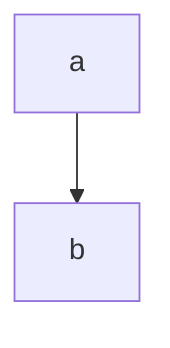

# HAHAHAH


tchuss 

<svg xmlns="http://www.w3.org/2000/svg" style="background-color: rgb(255, 255, 255);" xmlns:xlink="http://www.w3.org/1999/xlink" version="1.1" width="311px" height="61px" viewBox="-0.5 -0.5 311 61" content="<mxfile host=&quot;www.draw.io&quot; modified=&quot;2020-01-17T23:24:39.455Z&quot; agent=&quot;Mozilla/5.0 (Macintosh; Intel Mac OS X 10.15; rv:72.0) Gecko/20100101 Firefox/72.0&quot; etag=&quot;qPgiitNgwsre3lcEI45r&quot; version=&quot;12.5.5&quot; type=&quot;device&quot;><diagram id=&quot;i310P7V2PxhbN_4-2mTS&quot; name=&quot;Page-1&quot;>xVRNc5swEP01HNPhY0KcaxynPbTTgw9xjxuzQcoIlhGLgf76CrMYNEw8zSHthdF72l3pvWUVJNui+2qhUj8oQxPEYdYFyWMQx5vk3n0Hoh+Ju006ErnV2UhFM7HXv1HIUNhGZ1h7gUxkWFc+eaSyxCN7HFhLrR/2SsY/tYIcV8T+CGbNPuuMlciK72b+G+pcTSdHqQguYAoWJbWCjNoFleyCZGuJeFwV3RbN4N3ky5j39M7u5WIWS/6bhJ8v/FQ/1OkJUoBIHSDc724SuRv3k2DMnH6BZFlRTiWY3cw+WGrKDIeqoUNzzHeiypGRI9+QuZdmQsPkKMWFkV3sNB8W619DqS+3gh47qXwG/QRKtv1hCRZZA5zTzmjKG/UNot61TaiaGnvEK15Nvx/YHPlKXHxprhsKpALdfVyeRQOsT/49QH7P/BI3d9AtpIkfaKjUPYFp5CRYtdhvYKs0476Cs/bWDbHfLKmHlrG7buFasiTcywT0PmzneYqmIVGLWUrDT/IoXnn08t89ijf/zCQH51fnvLd4upPdHw==</diagram></mxfile>"><defs></defs><g><path id="ppp" d="M 120 30 L 183.63 30" fill="none" stroke="#000000" stroke-miterlimit="10" pointer-events="stroke"></path><path d="M 188.88 30 L 181.88 33.5 L 183.63 30 L 181.88 26.5 Z" fill="#000000" stroke="#000000" stroke-miterlimit="10" pointer-events="all"></path><rect x="0" y="0" width="120" height="60" fill="#ffffff" stroke="#000000" pointer-events="all"></rect><g transform="translate(-0.5 -0.5)"><switch><foreignObject style="overflow: visible; text-align: left;" pointer-events="none" width="100%" height="100%" requiredFeatures="http://www.w3.org/TR/SVG11/feature#Extensibility"><div xmlns="http://www.w3.org/1999/xhtml" style="display: flex; align-items: unsafe center; justify-content: unsafe center; width: 118px; height: 1px; padding-top: 30px; margin-left: 2px;"><div style="box-sizing: border-box; font-size: 0; text-align: center; "><div style="display: inline-block; font-size: 12px; font-family: Helvetica; color: #000000; line-height: 1.2; pointer-events: all; white-space: normal; word-wrap: normal; ">a</div></div></div></foreignObject><text x="60" y="34" fill="#000000" font-family="Helvetica" font-size="12px" text-anchor="middle">a</text></switch></g><rect x="190" y="0" width="120" height="60" fill="#ffffff" stroke="#000000" pointer-events="all"></rect><g transform="translate(-0.5 -0.5)"><switch><foreignObject style="overflow: visible; text-align: left;" pointer-events="none" width="100%" height="100%" requiredFeatures="http://www.w3.org/TR/SVG11/feature#Extensibility"><div xmlns="http://www.w3.org/1999/xhtml" style="display: flex; align-items: unsafe center; justify-content: unsafe center; width: 118px; height: 1px; padding-top: 30px; margin-left: 192px;"><div style="box-sizing: border-box; font-size: 0; text-align: center; "><div style="display: inline-block; font-size: 12px; font-family: Helvetica; color: #000000; line-height: 1.2; pointer-events: all; white-space: normal; word-wrap: normal; ">b</div></div></div></foreignObject><text x="250" y="34" fill="#000000" font-family="Helvetica" font-size="12px" text-anchor="middle">b</text></switch></g></g></svg>


<div class="mermaid">
graph LR
    A[Square Rect] -- Link text --> B((Circle))
    A --> C(Round Rect)
    B --> D{Rhombus}
    C --> D
</div>

## Plop
```
 fesfesjkl
fe sjfkesjlfsqej kfjse qlk
fsqejklf seqjlfk sqej
fseqjkflsejlk
```


## Plouf

<script src="https://unpkg.com/jquery@3.4.1/dist/jquery.min.js"></script>

<script type="text/javascript">
$("path#ppp").click(function(){$("#plouf")[0].scrollIntoView(true)})
</script>

<style>
path {
    fill:red;
    stroke:black;
    stroke-width:3;
    stroke-linejoin:round;
    stroke-linecap:round;
}
</style>
